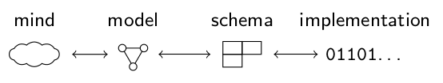
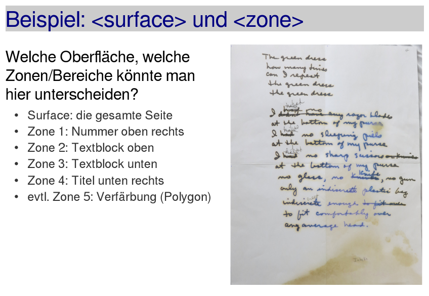
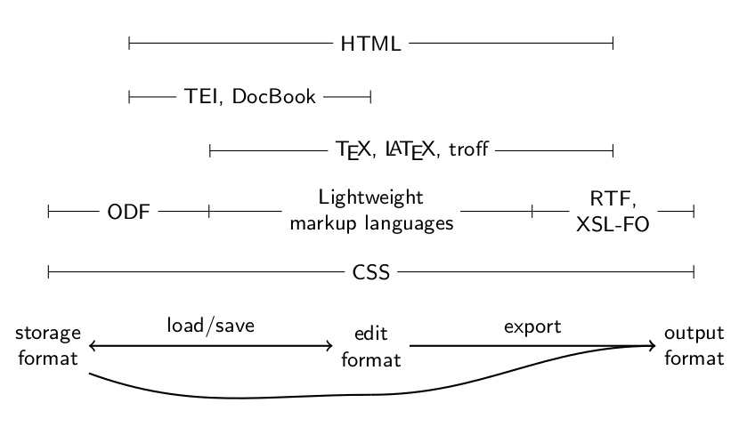
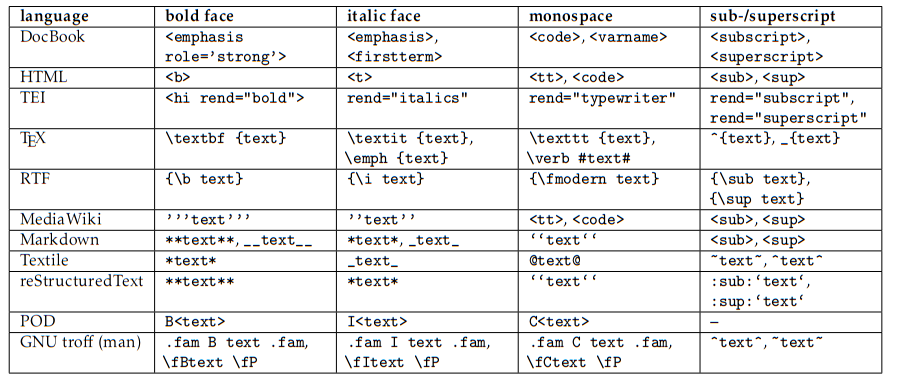
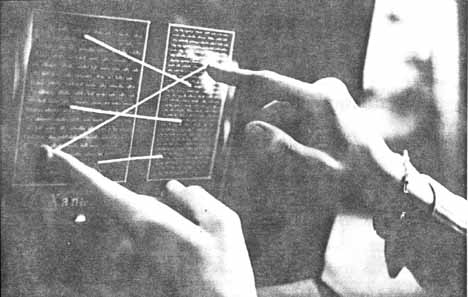

# Dokumente

## Was ist ein Dokument?

* Kernbegriff der Dokumentationswissenschaft
* Nicht einfach zu beantworten [@Buckland1997]
* Definition von @Briet1951

> A document is evidence in support of a fact [...] any physical
or symbolic sign, preserved or recorded, intended to represent, to
reconstruct, or to demonstrate a physical or conceptual phenomenon

## Beispiele für Dokumente?

* ...
* ...
* ...
* ...

## Beispiele für Dokumente

* Archäologische Objekte
* Spuren
* Publikationen
* Kunstwerke (sic)

## Daten als digitale Dokumente

* Auffassungen von Daten
	* Daten als Fakten (=> Fachgebiete)
	* Daten als Beobachtungen (=> Statistik)
	* Daten als Dokumente (=> Informationsmanagement)

* Semiotischer Ansatz: Daten/Dokumente als Zeichen für etwas

* Dokumente haben
    * Ursprung, Zwecke, Adressaten...
    * Form (*hier Thema*)

# Dokumentformate

---

## Arten von Datensprachen

* Modellierungs-Sprachen (UML, ERM...)
* **Schema-Sprachen** (RDF Schema, XML Schema, RegExp...)
	* Abfragesprachen (SQL, XPath...)
* **Datenstrukturierungssprachen** (CSV, XML, JSON...)
	* Auszeichnungssprachen (HTML, TEI, Markdown...)
* Kodierungen (Unicode, ASCII, Binärcode...)

## Beschreibung von Datenformaten

* Spezifikationen/Standards
* Schemata
    * z.B. ein XML-Schema für ein XML-Format
* Implementierungen (!)
* Datenstrukturierungssprache als Grundlage
    * z.B. XML für ein XML-Format

## Dateiformate

* Beliebige Datenformate für Daten in Dateien
* Oft Containerformate (MPEG, PDF...)
* Oft weitere Dateien/Datenbanken als Grundlage (z.B. ODT)
* *Ist "Datei" nicht zunehmend eine Methapher?*

## Exkurs: MIME-Type

* 1996: Multipurpose Internet Mail Extensions (MIME, 1996)
* content type / media type
* Verwendet u.A. in HTTP-Nachrichten
* Identifier für Dateiformate

==> *IANA list of official media types*

## Übung: Anatomie einer OpenDocument-Datei

* ...

## Medienformate

aka *Content-Formate*
	
* Formate und Kodierungen für "Inhalte"
* Audio-, Video-, Bild-Formate
	* Eigenes Thema, mehr Mathematik
* Prinzipiell alle Arten digitaler Dokumente

## Dokumentformate im engeren Sinne

* Seitenbeschreibungsprachen
	* PDF, PostScript, DVI...

* Dokumentformate für (Text-)Dokumente
    * OpenDocument Format
    * Plain Text
    * HTML
    * LaTeX
    * TEI
    * DocBook
    * EPUB
    * ...

* Basieren meist auf Auszeichnungssprachen

# Auszeichnungssprachen

## Was sind Auszeichnungssprachen?

* Modellierungs-Sprachen (UML, ERM...)
* Schema-Sprachen (RDF Schema, XML Schema, RegExp...)
	* Abfragesprachen (SQL, XPath...)
* Datenstrukturierungssprachen (CSV, XML, JSON...)
	* **Auszeichnungssprachen** (HTML, TEI, Markdown...)
* Kodierungen (Unicode, ASCII, Binärcode...)

## Beispiel: HTML

* Basiert (theoretisch) auf SGML/XML
* Spezifikation durch W3C
* Deskriptive Elemente (`<title>`, `<h1>`, `<em>`, `<code>`...)
* Präsentative Elemente (`<i>`, `<tt>`...)
* Legt zusammen mit CSS allgemeines Erscheinungsbild einer Webseite
  (oder EPUB, UI...) fest ("HTML-Design")

## Beispiel: TEI

* Text-Encoding Initiative (TEI) seit 1987 (!)
* Basierte auf SGML, inzwischen XML
* Verbreitet für Texteditionen in den Digital Humanities
* Umfangreiches Regelwerk der TEI
    * Mehr als 500 Elemente
    * Mehrere Module und Schemata

* Beschreibt welche Inhalte in einem Dokument vorkommen
  (deskriptiv)

## Beispiel für TEI

## Beispiel: Markdown

* Einfache Bearbeitung von Texten
* Beschränkung auf typische Elemente
    * Überschriften
    * Absätze, Listen, Tabellen, Bilder,
    * Fett, Kursiv
    * ...

## Übung: Markdown-Bearbeitung mit HackMD

<https://hackmd.io/>

## Anwendungsschwerpunkte von Auszeichnungssprachen

## Vergleich von Auszeichnungssprachen
 

## Konvertierung zwischen Dokumentformaten

Eingangsformat --> **Dokumentmodell** --> Ausgangsformat

* Datenmodell von Dokumentstrukturen
* Tool: Pandoc
    * <https://pandoc.org/>
    * <https://cloudconvert.com/>\
      <https://foliovision.com/seo-tools/pandoc-online>\
      ...

## Pandoc-Filter mit Pandoc::Elements (Perl)

\footnotesize

~~~perl
use Pandoc::Filter qw(pandoc_filter);
use Pandoc::Elements qw(BulletList Para Strong Str);

pandoc_filter DefinitionList => sub {
    BulletList [ map { to_bullet($_) } @{ $_->items } ]
};

sub to_bullet {
    my $item = shift;
    [ Para [ Strong $item->term ], map { @$_} @{$item->definitions} ]
}
~~~

## Pandoc-Filter mit panflute (Python)

\footnotesize

~~~python
from panflute import toJSONFilter, DefinitionList, BulletList, ListItem, Para, Strong

def deflists(elem, doc):
    if type(elem) == DefinitionList:
        bullets = [tobullet(item) for item in elem.content]
        return BulletList(*bullets)

def tobullet(item):
    ans = [Para(Strong(*item.term))]
    for definition in item.definitions:
        for block in definition.content:
            ans.append(block)
    return ListItem(*ans)

if __name__ == "__main__":
    toJSONFilter(deflists)
~~~

# Zusammenfassung und Ausblick

## Hypertext 

## Beyond the PDF

* Versionierung
* Annotationen
* Dynamische Dokumente
* Eingebettete Daten
* ...

Beispiele:

* Jupyter/iPython Notebook
* Hypothes.is

## Zusammenfassung

* Digitale Dokumente sind Datenobjekte,
  die als Dokument wahrgenommen werden
* Datenformat 
	* Dateiformat
	* Medienformat
		* **Dokumentformat**
* Auszeichnungssprachen
	* gibt es viele
	* basieren auf einem Dokumentmodell
	* haben kleinsten gemeinsamen Nenner

## Literatur- und Quellenangaben
\small

Quellcode dieser Folien: <https://github.com/hshdb/MWM-317-02>\
\
