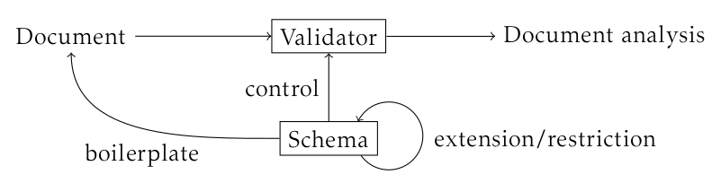

---

---

## Computerunterstützte Integration heterogenen Wissens

* Daten zusammenführen
* $\Rightarrow$ Informationen zusammenführen
* $\Rightarrow$ Wissen zusammenführen

## Datenwissenschaft

* Gibt es nicht in dieser Form
	* Vorschlag "Datalogy" [@Naur1966]
* Stattdessen Trends
	* EDV (1970/80er)
	* Linked Data (2006)
	* Big Data (2012)
	* Data Science (2013)

*Siehe Google Trends und ngram viewer*

## Daten-Trends

### EDV (1970/80er)
 
* Daten können automatisch verarbeitet werden

### Linked (Open) Data (ab 2006)

* Publikation von Daten in RDF

## Daten-Trends

### Big Data (2012)

* Immer mehr Daten werden automatisch erzeugt
* Viele Daten können statistisch ausgewertet werden

### Data (driven) Science (2013)

* (statistische) Datenanalyse
	* Data Mining
	* Künstliches Intelligenz
	* Visualisierung
	* ...

## Gemeinsamkeiten

* Daten können automatisch verarbeitet werden
	* weil eindeutig
* Immer mehr Daten werden publiziert
	* Computersysteme erzeugen mehr Daten
* Viele Daten können statistisch ausgewertet werden
	* Ist das relevant?

## Unterschiede

* Drei übliche Vorstellungen von Daten [@BallsunStanton2012]
	* Daten als Fakten
	* Daten als Beobachtungen
	* Daten als binäre Nachrichten
* Welche können/wollen wir integrieren?

## Daten als Fakten

* Reproduzierbare Ergebnisse von Messungen
* Beispiele
	* Masse der Erde
	* Einwohnerzahl einer Stadt
* Paradigma
	* Semantic Web / Linked Data
	* Metadaten?
* Problem
	* Post-Faktisches Zeitalter
	* Kontext

## Daten als Beobachtungen

* Aufgezeichnete Wahrnehmungen
* Beispiele
	* Audio- und Videoaufzeichnungen
	* Historische Aufzeichnungen
* Paradigma
	* Big Data / Statistik
* Problem
	* Fokus auf quantitative Analyse

## Daten als binäre Nachrichten

* Zeichen, die zur Kommunikation dienen
* Eindeutig, aber ohne direkten Bezug zur Realität
* Letztendlich eine Folge von Bits
* Paradigma
	* Forschungsdaten
	* digitale Dokumente
* Problem
	* Es kommt auf den Einzelfall an

## Daten als binäre Nachrichten

* Kommunikativer Akt steht im Vordergrund\
  (*Was will uns ... mit diesen Daten sagen?*) 
* Daten sind digitale **Dokumente**
	* Haben Ursprung, Form und Zwecke
* Kernthema der Bibliotheks- und Informationswissenschaft

## Zusammenfassung

* Daten als Fakten\
  => Einzelwissenschaften

* Daten als Beobachtungen\
  => Statistik & Maschinelles Lernen

* Daten als Dokumente\
  => Informationsmanagement

# Datenmodellierung

---

## Ebenen der Datenmodellierung

* Vorstellungen
	* von der Realität
	* von dem was in Daten enthalten ist/sein soll
* Modelle
	* mentale Modelle (z.B. Mind-Maps)
	* konkrete Modelle (Modellierungsprachen)
* Schemas
	* Schemasprachen (SQL, XML Schema...)
	* Datenstrukturierungssprachen (XML, JSON, CSV...)
* Umsetzung in Daten

---

## Beispiel/Übung

*Welche Studiengänge und ProfessorInnen gibt es im Deutschen Bibliotheks- und
Dokumentationswesen?*

## Beispiel

* Objekte, Eigenschaften, Beziehungen...
* Möglichkeiten und Beschränkungen
* Schreibweisen/Formate

## Mögliche Datenquellen

\small

* <http://www.kleinefaecher.de/bibliothekswissenschaft/>
* <http://www.kleinefaecher.de/informationswissenschaft/>
* <https://studieren.de/bibliotheks-und-dokumentationswesen.fachbereiche.t-0.f-67.html>
* Hochschulseiten
* [Hochschullehrerverzeichnis](https://www.hochschulverband.de/447.html)
* ...

## Mögliche Umsetzungen

\columstart

* Tabelle
* Strukturiertes Dokument
* Eigene Datenbank
* Vorhandene Datenbank (Wikidata)

\columnext

* Abtippen
* Wrapper
* APIs

\columend

# Datensprachen

## Arten von Datensprachen

* Modellierungs-Sprachen (UML, ERM...)
* Schema-Sprachen (RDF Schema, XML Schema, RegExp...)
	* Abfragesprachen (SQL, XPath...)
* Datenstrukturierungssprachen (CSV, XML, JSON...)
	* Auszeichnungssprachen (HTML, TEI, Markdown...)
* Kodierungen (Unicode, ASCII, Binärcode...)

## Modellierungssprachen: ERM

## Modellierungssprachen

* Entity-Relationship Model (ERM)
* Unified Modeling Language (UML)
* Object Role Modeling (ORM2)
* ...

## Modellierungssprachen: ORM2

## Modellierungssprachen

> the impact of the very substantial amount of work on modeling languages
appears to be minimal, with modelers apparently preferring to work with the
DBMS language

[@Simsion2007, S. 345]
 

## Schemasprachen

* Auch bekannt als
	* Datendefinition
	* Datenbeschreibung
	* Formatbeschreibung
	* ...

## Beispiele für Schemasprachen

* Backus-Naur-Form und Reguläre Ausdrücke
* XML Schema
* RDF Schema
* SQL
* JSON Schema
* ...

## Beispiel: SQL

~~~.sql
CREATE TABLE Authorships (
  workID int NOT NULL,
  authorID int NOT NULL,
  FOREIGN KEY (workID) REFERENCES Works(id),
  FOREIGN KEY (authorID) REFERENCES Authors(id),
  UNIQUE (workID, authorID)
)
~~~

## Beispiel: Syntaxdiagramm für JSON

~~~json
{
  "autor": [ 
     "...", 
     { "vorname": "...", "nachname": "..." }, 
  ],
  "titel": "..."
}
~~~

## Schemasprachen

* Eigene Syntax (mit Varianten!)
* Automatisierbar
* Anwendung für konkrete Datenstruktur

## Abfragesprachen

* XPath 
* XQuery
* SQL
* ...
* Programmiersprachen
* APIs
* ...
* Feldnamen

## Abfragesprachen

Auswahl von Teilen aus bestehenden Daten.

*Wichtig für jede Nutzung und Integration*

## Strukturierungssprachen

"Data structuring languages (DSL)" oder "data serialization languages" bilden
einen sehr groben Rahmen zur Formulierung von Daten.

* CSV
* XML
* INI
* JSON
* YAML
* RDF ohne Semantik
* ...

## Eigenschaften von Strukturierungssprachen

* Allgemeines Datenmodell
* Datentypen
	* Zahlen, Zeichenketten, Boolean...
	* Listen
	* Komplexere Typen (= eigene Formate)
* Syntax (mit Varianten)

## Allgemeine Datenmodelle

* Hierarchie (XML)
* Tabelle (CSV)
* Netzwerk (RDF)

Mischformen möglich durch Datentypen

## Auszeichnungssprachen

## Kodierungen

* Zeichen (ASCII, Unicode)
* Zahlen
* Identifier-Systeme

## Kodierungen

## Kodierungen

# Zusammenfassung

## Zusammenfassung Datensprachen

* Modellierungs-Sprachen (UML, ERM...)
* Schema-Sprachen (RDF Schema, XML Schema, RegExp...)
	* Abfragesprachen (SQL, XPath...)
* Datenstrukturierungssprachen (CSV, XML, JSON...)
	* Auszeichnungssprachen (HTML, TEI, Markdown...)
* Kodierungen (Unicode, ASCII, Binärcode...)

*Frage: Wo sind die meisten Probleme bei der Integration?*

## Zusammenfassung Daten

* Meist eher implizit behandelt
* Verschiedene Auffassungen
	* Daten als Fakten
	* Daten als Beobachtungen
	* Daten als Dokumente

## Weiterer Art der Gruppierung

Daten / Metadaten / Content

* Hängt mit Datensprachen und Auffassungen zusammmen!

## Literatur

\small
