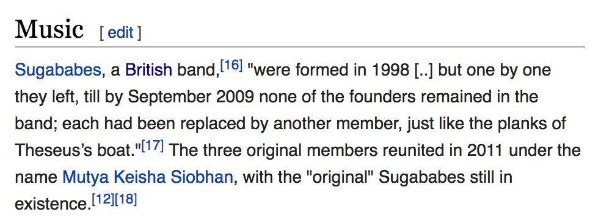
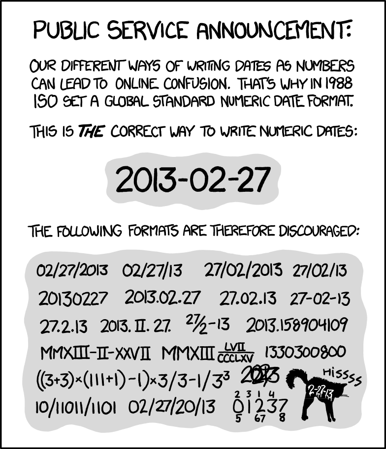

# Identität und Entitäten

## Grundannahme

* Daten allein haben keine Semantik
* Semantische Daten beziehen sich auf etwas
    * Werte (Zahlen, Namen...)
    * Dinge (Konzepte, Entitäten...)

## Daten-Werte

* Zahlen oder Zeichenketten
* Anzahl, Größe, Datum, Namen...
* Datentyp mit Kodierung
    * Integer, Unicode...
    * Mathematisch definierte Mengen
    * Wertebereiche und Einheiten!
* Vorstellung von Daten als Fakten oder Beobachtungen

## Daten-Dinge

## Daten-Dinge

* Im Kopf: Dinge
* Im Modell: Entitäten
* Im Schema: Identifier

Grundlage: @Kent1978, Chapter 1

## Was ist ein Ding?

* Einheit
    * Was ist "ein Ding"?
* Gleichheit
    * Wann sind zwei Dinge das Gleiche?
    * Wann ist ein Ding nicht mehr das Gleiche?
* Kategorien
    * Von welcher Art ist ein Ding?

## Entitäten-Einheit

* Beispiel: ein "Buch"
    * Ein Werk
    * Eine Auflage
    * Ein Exemplar
    * "nichtperiodische Publikationen mit einem Umfang von 49 Seiten oder mehr" (UNESCO)

* Worte und Konzepte sind vage!

## Eintitäten-Gleichheit: Identitätsprinzip

1. Wenn Dinge nicht unterscheidbar sind, sind sie identisch
2. Identische Dinge sind nicht unterscheidbar

## Entitäten-Gleichheit: Probleme

* Dinge erfüllen mehrere Rollen
    * z.B. Bibliothek als Gebäude, Sammlung, Organisation
* Dinge ändern sich

*Welche Eigenschaften sind für ein Informationssystem relevant?*

## Beispiel: Schiff des Theseus

\footnotesize

<https://en.wikipedia.org/wiki/List_of_Ship_of_Theseus_examples>

## Entitäten-Kategorien

* Legen fest was ein Ding ist
* Einteilung in (meist disjunkte) Mengen
* Klassifikation 

## Beispiel: Emporio celestial de conocimientos benévolos

> ... los animales se dividen en (a) pertenecientes al Emperador, (b) embalsamados, (c) amaestrados, (d) lechones, (e) sirenas, (f) fabulosos, (g) perros sueltos, (h) incluidos en esta clasificación, (i) que se agitan como locos, (j) innumerables, (k) dibujados con un pincel finísimo de pelo de camello, (1) etcétera, (m) que acaban de romper el jarrón, (n) que de lejos parecen moscas.

[@Borges1952]

## Beispiel: Classfication and its Consequences

* International Classification of Diseases (ICD)
* Südafrikanische Rassenklassifikation

[@bowker1999sorting]

## Umsetzung von Kategorien

* Disjunkte Datentypen
    * "Person"
    * "Organisation"
    * "Tätigkeit"
    * ...

* Implementierung
    * SQL-Tabellen
    * RDF-Klassen
    * Formate
    * ...

## Zusammenfassung: Fallstricke bei der Datenintegration

* Daten beziehen sich auf Werte oder Dinge
* Dinge sind nicht eindeutig (Einheit)
* Dinge ändern sich (Gleichheit)
* Dinge ordnen die Welt (Kategorien)

> ...Notoriamente no hay clasificación del universo que no sea arbitraria y conjetural. La
razón es muy simple: no sabemos qué cosa es el universo.

[@Borges1952]

## Beispiel: Data and Reality

Zusammenstellung in einem integrierten Informationssystem:

<https://www.wikidata.org/wiki/Q25625532>

@Kent1978

# Identifier

## Motivation

* Umsetzung von Entitäten in Daten
* Hilfreiche Strategien
	* Identifier-Systeme
	* Normdateien

# Identifier-Systeme 

## Beispiel: ISBN

## Bestandteile von Identifier(-Systemen)

Daten (Zeichenkette, Zahl...=*Identifier*) verweisen auf ein *Ding*

* In welchem Kontext (*Wo?*)
* Durch welche Vereinbarung oder Autorität (*Wer?*)
* Wo festgelegt und abrufbar (*Wie?*)

## Beziehungen zwischen Identifier-Systemen

## Anforderungen an Identifier-Systeme

* Eindeutige Identifier
* Dauerhafte Identifier
* Überschaubare (kurze) Identifier
* Lesbare/Geordnete/Verteilte/Strukturierte Identifier
* Ausführbare Identifier (z.B. URL)
* *Verlässliche Autoritäten und Infrastruktur!*

Beispiel: <http://purl.org/>

## Identifier-Namensräume

## Sonderfall: Hashcodes

Beispiel: SAH1 8624bcdae55baeef00cd11d5dfcfa60f68710a02

## Normdateien

* aka Stammdaten
* *Beispiele?*

# Möglichkeiten und Grenzen von Identifier-Systemen

## Worauf beziehen wir uns?

*Wer? Was? Warum? Wo? Wann? Wie? Womit?*

# Identität für lösbare Fälle

## Eher lösbare Identitäten

* Zeitangaben (*Wann?*)
* Orte (*Wo?*)
* Personen (*Wer?*)
* Mittel und Formen (*Womit?*) -> teilweise

## Identifier für Zeitangaben

* Genaue Zeitangaben: Daten als Fakten
    * ISO 8601 (`YYYY-MM-DDThh:mm:ss`)

* Erweiterte Zeitangaben: EDTF, `2012/2014`\
  <https://www.loc.gov/standards/datetime/>
    * Intervalle (`2017-04-01/open`)
    * Ungenauigkeit (`1984?`, `1984~`, `198x`)
    * Fehlende Angaben (`199u`) 
    * Jahreszeiten und große Jahreszahlen
    * Listen von Zeitangaben

*Syntax prüfbar durch erweiterte reguläre Ausdrücke*

## ISO 8601

## Normdateien für Zeitangaben

Zeitangaben in RDF mit **PeriodO** <http://perio.do/>

* Name(n) und Beschreibung
* Quellenangaben(n)
* Zeitliche Eingrenzung
* Räumliche Eingrenzung

Beispiel: <http://n2t.net/ark:/99152/p0qp9rs3drk>

## Identifier für Orte

* Geographische Koordinaten
* Verweise auf Ortsdatenbanken (mit Koordinaten)
* Gebäude u.A. Strukturen

*Kontinentalplatten bewegen sich einige cm pro Jahr*

## Normdateien für Orte

* ISO 3166
* Offizielle Kennziffern/Codes für Gemeinden u.Ä. 
* GeoNames
* OpenStreetMap
* Gazetteers
* ...

*Wikidata kennt fast 200 Properties für Orts-IDs*

## Beispiel: Pleiades

## Zeiten und Orte

* Orte sind eine 4-dimensionale Kartoffeln
    * Datenmodell CRM~geo~ [@niccolucci2016representing]
* Nicht trivial, aber Referenzrahmen in der physischen Welt

## Personen

*Wikidata kennt über 500 Properties für Personen-Identifier*

\footnotesize

<https://www.wikidata.org/wiki/Wikidata:List_of_properties/Person/Authority_control>

~~~
SELECT ?p ?pLabel ?pDescription {
  ?p wdt:P31 wd:Q19595382 .
  SERVICE wikibase:label {
    bd:serviceParam wikibase:language "de,en"
  }
}
~~~

*Aufgabe: Finde Nicht-Personen die eine Personen-ID in Wikidata haben*

# Identität für unlösbare Fälle

## Eher nicht lösbare Identitäten

* Allgemeine Konzepte (*Was?*)
* Prozesse (*Wie?*)
* Ursachen (*Warum?*)

## Allgemeine Konzepte

* Wissensorganisationssysteme
    * Glossare
    * Klassifikationen
    * Thesauri
    * Ontologien
    * ...

<http://bartoc.org/>

## Prozesse und Ursachen

* Netzwerke von weiteren Entitäten
* Dynamisch
* Nicht vollständig beschreibbar (Halteproblem)
* Behandlung wie
    * Allgemeine Konzepte
    * Dokumente/Werke

## Identifier bei der Datenintegration

* Gleiche Standards
* Konkordanzen und Mappings
* Entity Recognition/Reconciliation

## Konkordanzen und Mappings

* Wenn möglich 1-zu-1

    * Verschiedene Rollen?
    * Teil-Ganzes?
    * Grundproblem: Dinge <-> Entitäten 

* Automatische Verfahren
    * Labelbasiert
    * Instanzbasiert
    * ...

*--> mehr siehe nächste Einheit*

## Beispiel: Mix'n'match

* Tool zur Bearbeitung von Wikidata
    * <https://tools.wmflabs.org/mix-n-match/>

* Beispiele für Properties
    * GCD series ID\
      <https://www.wikidata.org/wiki/Property:P3589>
    * ISIL ID\
      <https://www.wikidata.org/wiki/Property:P791>
 
## Entity Recognition und Mapping

* Objektidentifikation
* Heuristiken
    * Sprachtechnologie
    * Hash-Werte
    * Edit-Distance
    * Vektorraum-Retrieval
    * ...

## Beispiel: OpenRefine

* Features
    * Datenbereinigung
    * Gruppierung und Clustering
    * Reconciling: Abgleich von Datensätzen mittels externer API

* Tutorial
    * Demo unter <http://vimeo.com/142641953>
    * Kurs (30 Minuten) unter <https://data-lessons.github.io/library-openrefine/>
    * <http://www.mnylc.org/fellows/2017/03/17/using-openrefine-to-reconcile-name-entities/>

* Reconciliation APIs

    * <https://tools.wmflabs.org/openrefine-wikidata/>
    * <http://lobid.org/organisations/reconcile>
    * <http://refine.codefork.com/reconcile/viaf>
    * <https://vivo.tib.eu/fis/reconcile>
    * ...

## Zusammenfassung

* Was ist ein Ding?
    * Einheit, Gleichheit, Kategorien
    * Festlegung durch Modellierung
    
* Identifier-Systeme
    * Notwendige Festlegung von Beziehungen
    * Verschiedene Anforderungen und Komplexitäten
        * Wann, Wo, Wer...
        * Was, Wie, Warum...
    * Einfache vs. schwierige Fälle
    * Sonderfall Hashcodes
    * Normdateien helfen

* Integration durch Standards, Mappings und Objektidentifikation

## Literatur

\small
Quellen dieser Folien: https://github.com/hshdb/MWM-317-02/\
\
