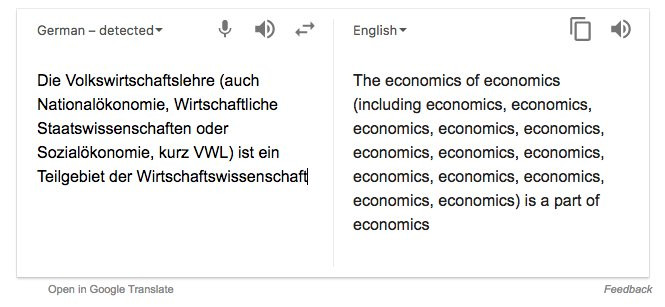

---
title: Künstliche Intelligenz
subtitle: Beiträge zur Informationsintegration
author: 
  - Jakob Voß
institute:
  - Hochschule Hannover
date: 2017-06-10
lang: de
multifilter:
  - arrows
...

# Künstliche Intelligenz

## Turing-Test

](img/turing_test.png)

## 1964-66: ELIZA

* Therapiegespräch beim Psychiater
* <http://www.masswerk.at/elizabot/>
* Joseph Weizenbaum (1923-2008)

Filmtipp: *Plug and Pray* (2010)

## Weitere Entwicklung der KI

* 1973: Lighthill report\
  *Überzogene Erwartungen*
* 1980–1987: Expertensysteme
* 1990er: Robotik u.A.\
  *Konkrete Anwendungen unter anderen Namen*

## Jüngere Erfolge der KI

* 1997 Deep Blue besiegt Garry Kasparov
* 2005 DARPA Grand Challenge
* 2011 Watson (IBM) gewinnt bei *Jeopardy!*

"klassisches" Maschinelles Lernen

## Aktuelle Entwicklungen

* 2015 AlphaGo
* Neuronale Netze (Deep Learning)
* Mehr Rechenkraft durch GPUs
* Mehr Trainingsdaten (Big Data)
 
Filmtipp: *Ex Machina* (2015)

## Aktuelle Entwicklungen

* Alltägliche Bild- und Spracherkennung
* Consumer-Produkte
  * Amazon Echo
  * Google Home
  * Apple Siri

Bsp. Google 2017: *mobile first* -> *AI first*

## Die Zukunft?

* Massiver Abbau von Arbeitsplätzen
* *Artificial general intelligence*
* *Technologische Singularität*
* 2015: *Open Letter on Artificial Intelligence*\
  (Musk, Hawking etc.) 

# Anwendungsfelder

## Was haben diese Anwendungsfelder gemeinsam?

* Bilderkennung (Gesichter, Objekte...)
* Sprachverarbeitung
* Text Mining
* Vorhersage von Verhalten
* ...

## Datenverarbeitung mittels KI

* Bild
* Ton
* Text
* Messwerten

\vfill

"Content" / Daten als Beobachtungen\
--> "strukturierte Daten" / Daten als Fakten

## Die Idee

](img/machine_learning_2x.png)

## Es funktioniert

* Optical Character Recognition (OCR)
* Objekterkennung in Bildern und Videos
* Automatische Übersetzung
* Entity Recognition in Texten

*Rechercheübung: Video zur Demonstration von Objekterkennung!*

## Deep Learning mit Neuronalen Netzen

\small

* Goggles Goggles (2009-2012)
    * Objekterkennung
    * Texterkennung 

* Hintergrund
    * <https://research.googleblog.com/2015/06/inceptionism-going-deeper-into-neural.html>
    * <https://deepdreamgenerator.com/gallery>

* Deep-Learning Dienste und Bibliotheken state-of-the-art

## Schwierigkeiten

## Schwierigkeiten

* Trainingsdaten
* Overfitting
* Menschen (=> Microsoft Chatbot Tay)

## Nochmal Jorge Borges

> ...Notoriamente no hay clasificación del universo que no sea arbitraria y
> conjetural. La razón es muy simple: no sabemos qué cosa es el universo.

[@Borges1952]

\vfill

Viele Möglichkeiten von Unbekanntem\
--> begrenzte Menge von Bekanntem

# Natural Language Processing (NLP)

## Natural Language Processing (NLP)

* NLP allgemein
    * Teil der Computerlinguistik

* NLP für die Datenintegration
    * Entity recognition und linking
    * Rule/Ontology mining from text (e.g. Wikipedia)

## Entity Recognition and Linking

Beispiele zum Ausprobieren

* <http://demo.dbpedia-spotlight.org/>
* <http://www.opencalais.com/>
* <https://gate.d5.mpi-inf.mpg.de/webaida/>

## Literatur
