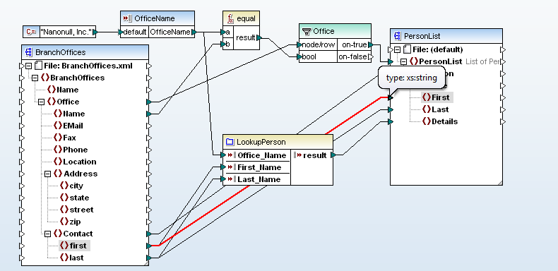

---
title: Semantische Datenintegration
subtitle: Mapping und Matching von Ontologien und Schemata
author: 
  - Jakob Voß
institute:
  - Hochschule Hannover
date: 2017-06-10
lang: de
multifilter:
  - arrows
  - qids
nocite: |
    @Euzenat2013
...

# Was ist Mapping und Matching?

## Mapping und Matching von Ontologien und Schemata

---------------- -----  -------------------
Schema            <->   Mapping

Ontology                Matching

Terminology             Crosswalk

Vocabulary              Concordance

...                     ...
---------------- -----  -------------------

* $\ge 4\times4$ mögliche Deskriptoren bei Prä-Kombination
* $\ge 4+4$ mögliche Deskriptoren bei Post-Kombination
* Reduktion durch (Quasi-)Synonyme Benennungen 

## Was kann gemappt werden?

Ebene            Form des Mappings
---------------- ---------------------------------
Mind             Begriffsklärung       
Model            Ontology oder Terminology Mapping
Schema           Ontology oder Schema Mapping
Implementation   Schema Mapping oder Konvertierung         
---------------- ---------------------------------

## Was soll gemappt werden?

* Terminology Mapping
    * Knowlede Organization Systems (KOS):\
      Normdateien, Thesauri, Klassifikationen...
* Ontology Mapping
    * Formallogische Systeme
* Schema Mapping
    * Datenformate

*Sprachgebrauch uneinheitlich!*

## Beispiele

* Model Mapping
    * _Wir müssen reden..._

* Terminology Mapping
    * Wikidata [Q15303972] = ORCID [0000-0002-7613-4123](https://orcid.org/0000-0002-7613-4123)

    * RVK [AN 65800](http://rvk.uni-regensburg.de/regensburger-verbundklassifikation-online#notation/AN%2065800) $\approx$ MeSH [D007998](https://meshb.nlm.nih.gov/#/record/ui?ui=D007998)

* Schema Mapping
    * Datenfelder

* Konvertierung
    * Zeichenkodierungen, Dateiformate...

## Wofür brauchen wir Mappings?

* Integration verschiedener Datenquellen\
  Export und Import in anderen Formaten
* Transformation und Migration eines Schemas
* Anfrageübersetzung

# Terminology Mappings

Mappings zur Anfrageübersetzung

* Crosswalks zwischen Vokabularen
    * Thesauri, Klassifikationen, Normdateien...
* Deskriptoren
* Information Retrieval

## Ausgangsfrage

* Anfrage in Vokabular A
* -> Übersetzung in Vokabular B
* Wie gut ist die Übersetzung?

## Beispiel

Vokabular A         Vokabular B
------------------- ----------------------
Aircraft            Aircraft 
                    -- Airplane
                    -- Helicopter
Military Aircraft   Aircraft AND Military
Pest control        Pest control
-- Pesticides
------------------- ----------------------

## Mögliche Äquivalenzen

* Ein Deskriptor
    * Gleiche Benennung (Ship = Ship)
    * Unterschiedliche Benennung (Ship = Vessel)
    * Weiter Begriffsumfang (Pesticides < Pest control)
    * Keine Entsprechung
* Mehrere Deskriptoren
    * OR-Kombination\
      (Aircraft = Aircraft OR Airplane OR Helicopter)
    * AND-Kombination\
      (Military Aircraft = Aircraft AND Military)
    * Komplexere Kombination\
      (Animal food = Animals + (hunting OR husbandry))

## Vorstellung: coli-conc

<http://coli-conc.gbv.de/>

* Sammlung von (Quellen für) KOS und Konkordanzen
* Software zur Verwaltung von KOS
* Bereitstellung von Konkordanzen
* Tool zur Erstellung und Bewertung von Konkordanzen

## Übung: Europeana Fashion Vocabulary/Thesaurus

*Kommen wir auf 100%?*

* <https://bartoc.org/en/node/1819>
* <https://www.wikidata.org/wiki/Property:P3832>
* <https://tools.wmflabs.org/mix-n-match/#/catalog/409>
* <https://www.wikidata.org/wiki/Wikidata:WikiProject_Fashion/Taxonomy/Europeana_Fashion_Vocabulary>

# Schema/Ontology Mapping

## Beispiel: Ontology-Mapping mit Wikidata

* equivalent class [P1709]
    * Book [Q571] -> <http://schema.org/Book>
* exact match [P2888]
    * Comic [Q1004] -> <http://schema.org/ComicStory>
    * Erdreich [Q36133] -> <http://aims.fao.org/aos/agrovoc/c_7156>
* narrower external class [P3950]
    * Sammler [Q3243461] -> <http://comicmeta.org/cbo/Collector>

Unterschied zwischen P1709 und P2888 etwas unklar.

Warum kein *broader external class?*

## Beispiel: Ontology-Mapping mit Wikidata

* equivalent property [P1628]
    * Teil von [P361] -> <http://schema.org/isPartOf> 
* external subproperty [P2235]
    * Ausgabe oder Übersetzung von [P629] -> <http://comicmeta.org/cbo/translationOf>
* external superproperty [P2236]
    * Vater [P22] -> <http://schema.org/parent>

Außerdem spezifische Properties für ausgewählte Vokabulare!

## Schema-Heterogenität

XML A

~~~xml
<article>
  <title>...</title>
  <url>...</url>
  <author>
    <name>...</name>
  </author>
</article>
~~~

XML B

~~~xml
<publication>
  <title>...</title>
  <creator>...</title>
</publication>
~~~

## Demo: unAPI-Server der VZG

* <http://unapi.gbv.de/>
* Beispiel
    * <http://unapi.gbv.de/?id=gvk:ppn:786718889>
* <https://github.com/gbv/transformers>

## Schema-Heterogenität

--------------- ------------
ARTICLE         PUBLICATION
-- ID           -- ID
-- title        -- title
-- URL          -- date 
AUTHORSHIP      -- author 
-- articleID
-- personID
PERSON
-- ID
-- name         
--------------- ------------

*Beispiel basiert auf Beispiel von @Leser2006*

## Schema/Ontology-Matching

Verfahren zur Erstellung von Schema-Mappings

* Umfangreiche Schemas
* Zahlreiche Schemas
* Unbekannte Schemas (fehlende Dokumentation) 

## Schema-Matching-Verfahren

Schema-Matching basiert auf

* Labels
* Instanzen
* Strukturen
* Mischformen

## Label-basiertes Matching

* Gleiche Namen
* Ähnliche Namen
* Übersetzungen
* ...

`author`, `authors`, `Autor`, `Urheber`...

## Instanz-basiertes Matching

* Idee
    * Gleiche oder ähnliche Werte(verteilungen)
* Annahmen
    * Beide Schemas müssen mit Werten gefüllt sein
    * Beide Datebasen müssen Duplikate enthalten
    * Duplikate müssen gleiche Attribute enthalten

* Beispiel
    * coli-conc Mapping-Algorithmus
    * Ein Datensatz hat Notationen mehrerer KOS
    * Kookkurenz => Semantische Ähnlichkeit

## Beispiel für Instanz-basiertes Matching

\columstart
\small

~~~.json
{
  "AAA": "Emma Goldman",
  "BBB": "2014",
  "CCC": "978-3-89401-810-8"
}
~~~

\columnext
\small

~~~.json
{
  "XXX": [ "Goldman, Emma" ],
  "YYY": "2014",
  "ZZZ": "9783894018108"
}
~~~

\columend

## Beispiel für Instanz-basiertes Matching

\columstart
\small

~~~.json
{
  "author": "Emma Goldman",
  "year": "2014",
  "isbn": "978-3-89401-810-8"
}
~~~

\columnext
\small

~~~.json
{
  "author": [ "Goldman, Emma" ],
  "date": "2014",
  "isbn": "9783894018108"
}
~~~

\columend

## Strukturbasiertes Matching

* Datentypen
* Nachbarschaftsbeziehungen 
* Hierarchien
* Constraints
* ...

Sinnvoll vor allem in Mischformen

## Zusammenfassung Matching-Verfahren

* Label/Instanz/Struktur + Mischformen
* State of the art nach [@OteroCerdeira2015]
    * Review von 1600 bzw. 700 Fachartikeln (2003-2013)
    * Vor allem theoretische Ansätze
    * Weniger praktische Anwendungen
    * Bestehende Herausforderungen
* Kluft zwischen Automatischen und Manuellen Ansätzen (mein Eindruck)

## Mapping-Tools

* Viele Forschunsgssysteme
    * <http://oaei.ontologymatching.org/> (OAEI)
    * <http://ontologymatching.org/>
* Bestandteil einiger ETL- und BD-Tools
* Einige erfolgreiche kommerzielle Systeme
    * Eher spezialisiert
    * Mehr Konvertierung und Mapping statt Matching

## Beispiel: Altanova MapForce

## Literatur und Quellen

\small
Quellen dieser Folien: https://github.com/hshdb/MWM-317-02/\

Folien zu *Terminology Mappings* basieren grob auf Unterlagen eines Tutorials von Dagobert Soergel auf der ECDL 2008 (S. 189-192)\
\

