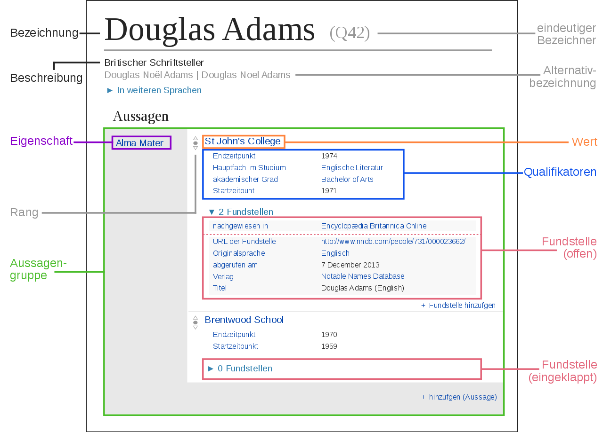

---
title: Semantische Datenintegration
subtitle: Die integrierende Datenbank Wikidata
author: 
  - Jakob Voß
institute:
  - Hochschule Hannover
date: 2017-04-01
lang: de
multifilter:
  - qids
...

# Wikidata-Einführung

## Was ist Wikidata?

Wikipedia
  : freie Enzyklopädie in Form eines Wikis

Wikidata
  : freie Datenbank in Form eines Wikis

* betrieben von der Wikimedia Foundation
* basieren auf der Wiki-Software "MediaWiki"

## Freie Datenbank in Form eines Wikis

* Freie Weiterverwendung der Daten (CC0)
* Freie und öffentliche Bearbeitung
* Versionierung (wann wurde was durch wen geändert)
* Datenbank

## Ziele von Wikidata

1. Wikipedia-Sprachversionen miteinander verknüpfen
2. Daten aus Wikipedia-Infoboxen zentral verwalten
3. Komplexe Abfragen über alle Daten

## Geschichte

* Die Idee gibt es seit mindestens 2004
* Erster Versuch: Semantic MediaWiki 2005 (Vrandečić/Krötzsch)
    * Entwicklung am KIT
    * Erfolgreich, aber nicht bei Wikimedia
* Zweiter Versuch: Wikidata 2012 (Vrandečić et al.)
    * Entwicklung bei Wikimedia Deutschland e.V.
    * Erste Version Ende 2012
    * Integration von Freebase 2015
    * Entwicklung noch nicht abgeschlossen

## Bestandteile von Wikidata

* Objekte/Items (`Q...`)
    * z.B. [Q2013] "Wikidata"
    * z.B. [Q18618629] "Denny Vrandečić"
    * z.B. [Q593744] "Wissensdatenbank"
* Eigenschaften/Properties (`P...`)
    * z.B. [P112] "Gründer"
    * z.B. [P31] "ist ein(e)"
* Normale Wiki-Seiten
    * Hilfe, Diskussionen...

--- 

## Übung: Erste Bearbeitungen

* Beliebige Bearbeitungen\
  <https://www.wikidata.org/wiki/Wikidata:Sandbox>

* Sinnvolle Bearbeitungen
    * Beispiel: ProfessorInnen des Bibliotheks- und Informationswesen
    1. Vorhandenes Objekt suchen
    2. Aussagen ergänzen
    3. Neues Objekt anlegen
    4. Aussagen (möglichst mit Quellen) hinzufügen

# Datenintegration mit Wikidata

## Arten den Integration

* Physische Informationsintegration
    * Einmalige Integration mehrerer Wikipedias
    * Daten/Informationen aus anderen Quellen werden in Wikidata gesammelt
    * Daten aus Wikidata können zusammengeführt weiterverwendet werden

* Virtuelle Informationsintegration
    * Inhalte aus Wikidata werden in anderen Wikis angezeigt
    * Objekte in Wikidata werden mit anderen Datenquellen verknüpft
    * Daten aus Wikidata und anderen Datenquellen können einfacher integriert werden

## Physische Integration mit Wikidata

* Quellenangaben
* Tools/Bots zum Massenimport
* Abfragemöglichkeiten (-->)

## Beispiel: Abfrage mit wdtaxonomy

## Beispiel: Abfrage per SPARQL

Übung: <http://query.wikidata.org/>

## Virtuelle Integration mit Wikidata 

* Verknüpfung per Identifier
* Abfragemöglichkeiten (-->)

## Verknüpfung per Identifier

Beispiele:

* GND-ID ([P227])
* GCD Serien-ID ([P3589])

Übung: *mix'n'match*

## Datensprachen von und für Wikidata

* Modellierungs-Sprache: *individuell*
* Schema-Sprache:\
  Wikidata-Eigenschaften für Eigenschaften
* Abfragesprachen:\
  SPARQL, API, Wikibase-Funktionen, eigene Skripte...
* Datenstrukturierungssprache:\
  Wikidata-Datenmodell (Items, Properties, Qualifier...) 
* Serialisierungen/Kodierungen:
    * JSON und RDF (per API und Dumps)
    * Unicode und URIs (Grundlage)

## Wikidata-Schemas

* Wikidata-Eigenschaften für Eigenschaften
* Noch nicht vollständig umgesetzt
* Validierung erst *nachträglich* und *optional*
* Beispiele:
    * GND-ID ([P227])
    * GCD Serien-ID ([P3589])

# Abfragen aus Wikidata

## Abfrage- und Serialisierung

* Zugriff in JSON per MediaWiki-API
* Zugriff via RDF per SPARQL

## Anwendungen

* Verschiedenartige Darstellungen und Abfragen möglich
    * <http://www.wikidata.org/entity/Q22279816>
    * <https://tools.wmflabs.org/sqid/#/view?id=Q22279816>
    * <https://tools.wmflabs.org/reasonator/?&lang=de&q=22692845>
    * [Histropedia](http://histropedia.com/timeline/2j2stpg9bg0t/Pixar-animated-films)

* Föderierte Anfragemöglichkeiten (SPARQL federated queries)

## Abfragen per SPARQL

*Übung bei Bedarf*

